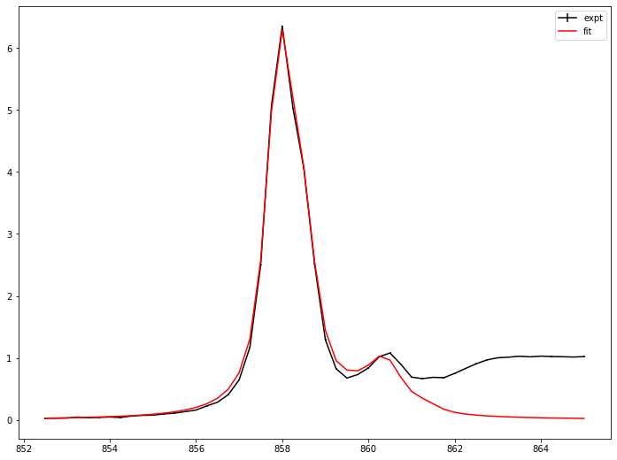
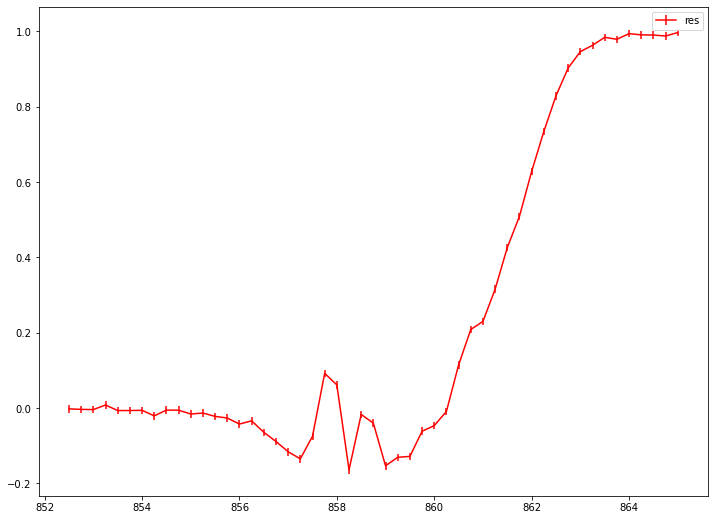

# Fitting with Static spectrum (Model: theoretical spectrum)
## Objective
1. Fitting with voigt broadened theoretical spectrum
2. Save and Load fitting result
3. Retrieve or interpolate experimental spectrum based on fitting result and calculates its derivative up to 2.


```python
# import needed module
import numpy as np
import matplotlib.pyplot as plt
import TRXASprefitpack
from TRXASprefitpack import voigt_thy, edge_gaussian
plt.rcParams["figure.figsize"] = (12,9)
```

## Version information


```python
print(TRXASprefitpack.__version__)
```

    0.6.1.dev
    


```python
# Generates fake experiment data
# Model: sum of 2 normalized theoretical spectrum

edge_type = 'g'
e0_edge = np.array([860.5, 862])
fwhm_edge = np.array([1, 1.5])
peak_shift = np.array([-862.5, -863])
mixing = np.array([0.3, 0.7])
mixing_edge = np.array([0.3, 0.7])
fwhm_G_thy = 0.3
fwhm_L_thy = 0.5

thy_peak = np.empty(2, dtype=object)
thy_peak[0] = np.genfromtxt('Ni_example_1.stk')
thy_peak[1] = np.genfromtxt('Ni_example_2.stk')

# set scan range
e = np.linspace(852.5, 865, 51)

# generate model spectrum
model_static = mixing[0]*voigt_thy(e, thy_peak[0], fwhm_G_thy, fwhm_L_thy,
peak_shift[0], policy='shift')+\
    mixing[1]*voigt_thy(e, thy_peak[1], fwhm_G_thy, fwhm_L_thy,
    peak_shift[1], policy='shift')+\
        mixing_edge[0]*edge_gaussian(e-e0_edge[0], fwhm_edge[0])+\
            mixing_edge[1]*edge_gaussian(e-e0_edge[1], fwhm_edge[1])

# set noise level
eps = 1/100
# generate random noise
noise_static = np.random.normal(0, eps, model_static.size)

# generate measured static spectrum
obs_static = model_static + noise_static
eps_static = eps*np.ones_like(model_static)
```


```python
# plot model experimental data

plt.errorbar(e, obs_static, eps_static, label='static')
plt.legend()
plt.show()
```


    

    


Before fitting, we need to guess about initial peak shift paramter for theoretical spectrum


```python
# Guess initial peak_shift
# check with arbitary fwhm paramter and peak_shift paramter
e_tst = np.linspace(-10, 20, 120)
comp_1 = voigt_thy(e_tst, thy_peak[0], 0.5, 1, 0, policy='shift')
comp_2 = voigt_thy(e_tst, thy_peak[1], 0.5, 1, 0, policy='shift')

plt.plot(e_tst, comp_1, label='comp_1')
plt.plot(e_tst, comp_2, label='comp_2')
plt.legend()
plt.show()

```


    

    


Compare first peak position, we can set initial peak shift paramter for both component as $-863$, $-863$.
First try with only one component


```python
from TRXASprefitpack import fit_static_thy
# initial guess
policy = 'shift'
peak_shift_init = np.array([-863])
fwhm_G_thy_init = 0.5
fwhm_L_thy_init = 0.5

result_1 = fit_static_thy(thy_peak[:1], fwhm_G_thy_init, fwhm_L_thy_init, policy, peak_shift_init, do_glb=True,
e=e, intensity=obs_static, eps=eps_static)
```


```python
print(result_1)
```

    [Model information]
        model : thy
        policy: shift
     
    [Optimization Method]
        global: basinhopping
        leastsq: trf
     
    [Optimization Status]
        nfev: 2636
        status: 0
        global_opt msg: requested number of basinhopping iterations completed successfully
        leastsq_opt msg: `ftol` termination condition is satisfied.
     
    [Optimization Results]
        Data points: 51
        Number of effective parameters: 4
        Degree of Freedom: 47
        Chi squared:  137064.2191
        Reduced chi squared:  2916.26
        AIC (Akaike Information Criterion statistic):  410.7153
        BIC (Bayesian Information Criterion statistic):  418.4426
     
    [Parameters]
        fwhm_G:  0.51383066 +/-  0.31636691 ( 61.57%)
        fwhm_L:  0.54523423 +/-  0.23628771 ( 43.34%)
        peak_shift 1: -862.66426446 +/-  0.03382879 ( 0.00%)
     
    [Parameter Bound]
        fwhm_G:  0.25 <=  0.51383066 <=  1
        fwhm_L:  0.25 <=  0.54523423 <=  1
        peak_shift 1: -863.40939898 <= -862.66426446 <= -862.59060102
     
    [Component Contribution]
        Static spectrum
         thy 1:  100.00%
     
    [Parameter Correlation]
        Parameter Correlations >  0.1 are reported.
        (fwhm_L, fwhm_G) = -0.919
    

Using `static_spectrum` function in TRXASprefitpack, you can directly evaluates fitted static spectrum from fitting result


```python
# plot fitting result and experimental data
from TRXASprefitpack import static_spectrum

plt.errorbar(e, obs_static, eps_static, label=f'expt', color='black')
plt.errorbar(e, static_spectrum(e, result_1), label=f'fit', color='red')

plt.legend()
plt.show()
```


    

    


The fit looks not good, there may exists one more component.


```python
# initial guess
# add one more thoeretical spectrum
policy = 'shift'
peak_shift_init = np.array([-863, -863])
# Note that each thoeretical spectrum shares full width at half maximum paramter
fwhm_G_thy_init = 0.5
fwhm_L_thy_init = 0.5

result_2 = fit_static_thy(thy_peak, fwhm_G_thy_init, fwhm_L_thy_init, policy, peak_shift_init, do_glb=True,
e=e, intensity=obs_static, eps=eps_static)

```


```python
print(result_2)
```

    [Model information]
        model : thy
        policy: shift
     
    [Optimization Method]
        global: basinhopping
        leastsq: trf
     
    [Optimization Status]
        nfev: 3846
        status: 0
        global_opt msg: requested number of basinhopping iterations completed successfully
        leastsq_opt msg: Both `ftol` and `xtol` termination conditions are satisfied.
     
    [Optimization Results]
        Data points: 51
        Number of effective parameters: 6
        Degree of Freedom: 45
        Chi squared:  120072.2846
        Reduced chi squared:  2668.273
        AIC (Akaike Information Criterion statistic):  407.9652
        BIC (Bayesian Information Criterion statistic):  419.5562
     
    [Parameters]
        fwhm_G:  0.25000000 +/-  0.44698553 ( 178.79%)
        fwhm_L:  0.60245650 +/-  0.20805220 ( 34.53%)
        peak_shift 1: -862.59060102 +/-  0.23266215 ( 0.03%)
        peak_shift 2: -862.98100038 +/-  0.11578250 ( 0.01%)
     
    [Parameter Bound]
        fwhm_G:  0.25 <=  0.25000000 <=  1
        fwhm_L:  0.25 <=  0.60245650 <=  1
        peak_shift 1: -863.40939898 <= -862.59060102 <= -862.59060102
        peak_shift 2: -863.40939898 <= -862.98100038 <= -862.59060102
     
    [Component Contribution]
        Static spectrum
         thy 1:  34.08%
         thy 2:  65.92%
     
    [Parameter Correlation]
        Parameter Correlations >  0.1 are reported.
        (fwhm_L, fwhm_G) = -0.886
        (peak_shift 1, fwhm_G) =  0.352
        (peak_shift 1, fwhm_L) = -0.491
        (peak_shift 2, fwhm_G) = -0.439
        (peak_shift 2, fwhm_L) =  0.544
        (peak_shift 2, peak_shift 1) = -0.855
    


```python
plt.errorbar(e, obs_static, eps_static, label=f'expt', color='black')
plt.errorbar(e, static_spectrum(e, result_2), label=f'fit', color='red')

plt.legend()
plt.show()
```


    

    


```python
# plot residual
plt.errorbar(e, obs_static-static_spectrum(e, result_2), eps_static, label=f'res', color='red')

plt.legend()
plt.show()
```


    

    


Residual suggests that there exists gaussian edge feature near 862 with fwhm 2


```python
# try with two theoretical component and edge

# refine initial guess
policy = 'shift'
peak_shift_init = np.array([-862.6, -863])
# Note that each thoeretical spectrum shares full width at half maximum paramter
fwhm_G_thy_init = 0.25
fwhm_L_thy_init = 0.5
# add one edge feature
e0_edge_init = np.array([862])
fwhm_edge_init = np.array([2])

result_2_edge = fit_static_thy(thy_peak, fwhm_G_thy_init, fwhm_L_thy_init, policy, peak_shift_init,
edge='g', edge_pos_init=e0_edge_init, edge_fwhm_init=fwhm_edge_init, do_glb=True,
e=e, intensity=obs_static, eps=eps_static)
```


```python
# print fitting result
print(result_2_edge)
```

    [Model information]
        model : thy
        policy: shift
        edge: g
     
    [Optimization Method]
        global: basinhopping
        leastsq: trf
     
    [Optimization Status]
        nfev: 4542
        status: 0
        global_opt msg: requested number of basinhopping iterations completed successfully
        leastsq_opt msg: Both `ftol` and `xtol` termination conditions are satisfied.
     
    [Optimization Results]
        Data points: 51
        Number of effective parameters: 9
        Degree of Freedom: 42
        Chi squared:  97.6489
        Reduced chi squared:  2.325
        AIC (Akaike Information Criterion statistic):  51.1272
        BIC (Bayesian Information Criterion statistic):  68.5136
     
    [Parameters]
        fwhm_G:  0.29748659 +/-  0.00905020 ( 3.04%)
        fwhm_L:  0.50042700 +/-  0.00665038 ( 1.33%)
        peak_shift 1: -862.50336897 +/-  0.00724165 ( 0.00%)
        peak_shift 2: -862.99723889 +/-  0.00313471 ( 0.00%)
        E0_g 1:  861.57402488 +/-  0.01821328 ( 0.00%)
        fwhm_(g, edge 1):  2.35124636 +/-  0.06005539 ( 2.55%)
     
    [Parameter Bound]
        fwhm_G:  0.125 <=  0.29748659 <=  0.5
        fwhm_L:  0.25 <=  0.50042700 <=  1
        peak_shift 1: -862.90442031 <= -862.50336897 <= -862.29557969
        peak_shift 2: -863.30442031 <= -862.99723889 <= -862.69557969
        E0_g 1:  858 <=  861.57402488 <=  866
        fwhm_(g, edge 1):  1 <=  2.35124636 <=  4
     
    [Component Contribution]
        Static spectrum
         thy 1:  14.44%
         thy 2:  35.14%
         g type edge 1:  50.42%
     
    [Parameter Correlation]
        Parameter Correlations >  0.1 are reported.
        (fwhm_L, fwhm_G) = -0.846
        (peak_shift 1, fwhm_G) =  0.306
        (peak_shift 1, fwhm_L) = -0.601
        (peak_shift 2, fwhm_G) = -0.378
        (peak_shift 2, fwhm_L) =  0.599
        (peak_shift 2, peak_shift 1) = -0.667
        (E0_g 1, fwhm_G) = -0.146
        (E0_g 1, fwhm_L) =  0.194
        (E0_g 1, peak_shift 1) = -0.138
        (fwhm_(g, edge 1), fwhm_G) =  0.116
        (fwhm_(g, edge 1), fwhm_L) = -0.181
        (fwhm_(g, edge 1), peak_shift 1) =  0.185
        (fwhm_(g, edge 1), E0_g 1) =  0.211
    


```python
# plot fitting result and experimental data

plt.errorbar(e, obs_static, eps_static, label=f'expt', color='black')
plt.errorbar(e, static_spectrum(e, result_2_edge), label=f'fit', color='red')

plt.legend()
plt.show()


```


    

    


```python
# plot residual
plt.errorbar(e, obs_static-static_spectrum(e, result_2_edge), eps_static, label=f'fit', color='red')

plt.legend()
plt.show()
```


    

    


fit_static_thy supports adding multiple edge feature, to demenstrate this I add one more edge feature in the fitting model.


```python
# add one more edge

# refine initial guess
policy = 'shift'
peak_shift_init = np.array([-862.6, -863])
# Note that each thoeretical spectrum shares full width at half maximum paramter
fwhm_G_thy_init = 0.25
fwhm_L_thy_init = 0.5
# add one edge feature
e0_edge_init = np.array([860.5, 862])
fwhm_edge_init = np.array([0.5, 1.5])

result_2_edge_2 = fit_static_thy(thy_peak, fwhm_G_thy_init, fwhm_L_thy_init, policy, peak_shift_init,
edge='g', edge_pos_init=e0_edge_init, edge_fwhm_init=fwhm_edge_init, do_glb=True,
e=e, intensity=obs_static, eps=eps_static)
```


```python
print(result_2_edge_2)
```

    [Model information]
        model : thy
        policy: shift
        edge: g
     
    [Optimization Method]
        global: basinhopping
        leastsq: trf
     
    [Optimization Status]
        nfev: 5713
        status: 0
        global_opt msg: requested number of basinhopping iterations completed successfully
        leastsq_opt msg: Both `ftol` and `xtol` termination conditions are satisfied.
     
    [Optimization Results]
        Data points: 51
        Number of effective parameters: 12
        Degree of Freedom: 39
        Chi squared:  25.6906
        Reduced chi squared:  0.6587
        AIC (Akaike Information Criterion statistic): -10.9706
        BIC (Bayesian Information Criterion statistic):  12.2113
     
    [Parameters]
        fwhm_G:  0.29360859 +/-  0.00491427 ( 1.67%)
        fwhm_L:  0.50438545 +/-  0.00359899 ( 0.71%)
        peak_shift 1: -862.50611534 +/-  0.00394140 ( 0.00%)
        peak_shift 2: -862.99841716 +/-  0.00168610 ( 0.00%)
        E0_g 1:  860.49623158 +/-  0.05649287 ( 0.01%)
        E0_g 2:  862.00489693 +/-  0.04652747 ( 0.01%)
        fwhm_(g, edge 1):  0.97264858 +/-  0.11786236 ( 12.12%)
        fwhm_(g, edge 2):  1.49750092 +/-  0.08837834 ( 5.90%)
     
    [Parameter Bound]
        fwhm_G:  0.125 <=  0.29360859 <=  0.5
        fwhm_L:  0.25 <=  0.50438545 <=  1
        peak_shift 1: -862.90442031 <= -862.50611534 <= -862.29557969
        peak_shift 2: -863.30442031 <= -862.99841716 <= -862.69557969
        E0_g 1:  859.5 <=  860.49623158 <=  861.5
        E0_g 2:  859 <=  862.00489693 <=  865
        fwhm_(g, edge 1):  0.25 <=  0.97264858 <=  1
        fwhm_(g, edge 2):  0.75 <=  1.49750092 <=  3
     
    [Component Contribution]
        Static spectrum
         thy 1:  15.00%
         thy 2:  34.99%
         g type edge 1:  15.17%
         g type edge 2:  34.84%
     
    [Parameter Correlation]
        Parameter Correlations >  0.1 are reported.
        (fwhm_L, fwhm_G) = -0.847
        (peak_shift 1, fwhm_G) =  0.33
        (peak_shift 1, fwhm_L) = -0.624
        (peak_shift 2, fwhm_G) = -0.384
        (peak_shift 2, fwhm_L) =  0.601
        (peak_shift 2, peak_shift 1) = -0.654
        (E0_g 2, fwhm_L) = -0.114
        (E0_g 2, peak_shift 1) =  0.136
        (E0_g 2, E0_g 1) =  0.915
        (fwhm_(g, edge 1), fwhm_G) =  0.142
        (fwhm_(g, edge 1), fwhm_L) = -0.227
        (fwhm_(g, edge 1), peak_shift 1) =  0.272
        (fwhm_(g, edge 1), E0_g 1) =  0.779
        (fwhm_(g, edge 1), E0_g 2) =  0.782
        (fwhm_(g, edge 2), peak_shift 1) = -0.11
        (fwhm_(g, edge 2), E0_g 1) = -0.816
        (fwhm_(g, edge 2), E0_g 2) = -0.88
        (fwhm_(g, edge 2), fwhm_(g, edge 1)) = -0.653
    


```python
plt.errorbar(e, obs_static, eps_static, label=f'expt', color='black')
plt.errorbar(e, static_spectrum(e, result_2_edge), label=f'fit (one edge)', color='red')
plt.errorbar(e, static_spectrum(e, result_2_edge_2), label=f'fit (two edge)', color='blue')

plt.legend()
plt.show()
```


    

    


```python
# save and load fitting result
from TRXASprefitpack import save_StaticResult, load_StaticResult

save_StaticResult(result_2_edge_2, 'static_example_thy') # save fitting result to static_example_thy.h5
loaded_result = load_StaticResult('static_example_thy') # load fitting result from static_example_thy.h5
```


```python
# plot static spectrum
plt.plot(e, static_spectrum(e, loaded_result), label='static', color='black')
plt.plot(e, static_spectrum(e-1, loaded_result), label='static (1 eV shift)', color='blue')
plt.plot(e, static_spectrum(e+1, loaded_result), label='static (-1 eV shift)', color='red')
plt.legend()
plt.show()
```


    

    


```python
# plot its derivative up to second
plt.plot(e, static_spectrum(e, loaded_result, deriv_order=1), label='1st deriv', color='red')
plt.plot(e, static_spectrum(e, loaded_result, deriv_order=2), label='2nd deriv', color='blue')
plt.legend()
plt.show()
```


    

    


Optionally, you can calculated `F-test` based confidence interval


```python
from TRXASprefitpack import confidence_interval

ci_result = confidence_interval(loaded_result, 0.05) # set significant level: 0.05 -> 95% confidence level
print(ci_result) # report confidence interval
```

    [Report for Confidence Interval]
        Method: f
        Significance level:  5.000000e-02
     
    [Confidence interval]
        0.29360859 -  0.00599374 <= b'fwhm_G' <=  0.29360859 +  0.00511557
        0.50438545 -  0.00268799 <= b'fwhm_L' <=  0.50438545 +  0.00269738
        -862.50611534 -  0.00478255 <= b'peak_shift 1' <= -862.50611534 +  0.00482451
        -862.99841716 -  0.00227236 <= b'peak_shift 2' <= -862.99841716 +  0.00227604
        860.49623158 -  0.0426757 <= b'E0_g 1' <=  860.49623158 +  0.041954
        862.00489693 -  0.02952428 <= b'E0_g 2' <=  862.00489693 +  0.02946051
        0.97264858 -  0.12788429 <= b'fwhm_(g, edge 1)' <=  0.97264858 +  0.13804003
        1.49750092 -  0.08512559 <= b'fwhm_(g, edge 2)' <=  1.49750092 +  0.0881816
    


```python
# compare with ase
from scipy.stats import norm

factor = norm.ppf(1-0.05/2)

print('[Confidence interval (from ASE)]')
for i in range(loaded_result['param_name'].size):
    print(f"{loaded_result['x'][i] :.8f} - {factor*loaded_result['x_eps'][i] :.8f}", 
          f"<= {loaded_result['param_name'][i]} <=", f"{loaded_result['x'][i] :.8f} + {factor*loaded_result['x_eps'][i] :.8f}")
```

    [Confidence interval (from ASE)]
    0.29360859 - 0.00963180 <= b'fwhm_G' <= 0.29360859 + 0.00963180
    0.50438545 - 0.00705388 <= b'fwhm_L' <= 0.50438545 + 0.00705388
    -862.50611534 - 0.00772500 <= b'peak_shift 1' <= -862.50611534 + 0.00772500
    -862.99841716 - 0.00330469 <= b'peak_shift 2' <= -862.99841716 + 0.00330469
    860.49623158 - 0.11072399 <= b'E0_g 1' <= 860.49623158 + 0.11072399
    862.00489693 - 0.09119217 <= b'E0_g 2' <= 862.00489693 + 0.09119217
    0.97264858 - 0.23100598 <= b'fwhm_(g, edge 1)' <= 0.97264858 + 0.23100598
    1.49750092 - 0.17321836 <= b'fwhm_(g, edge 2)' <= 1.49750092 + 0.17321836
    

In many case, ASE does not much different from more sophisticated `f-test` based error estimation.
