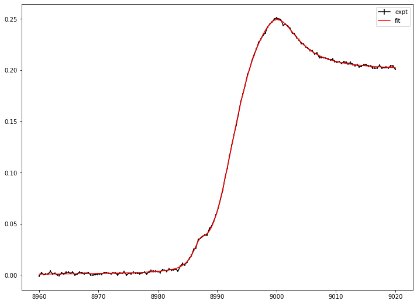

# Fitting with Static spectrum (Model: Voigt)
## Objective
1. Fitting with sum of voigt profile model
2. Save and Load fitting result
3. Retrieve or interpolate experimental spectrum based on fitting result and calculates its derivative up to 2.


```python
# import needed module
import numpy as np
import matplotlib.pyplot as plt
import TRXASprefitpack
from TRXASprefitpack import voigt, edge_gaussian
plt.rcParams["figure.figsize"] = (12,9)
```

## Version information


```python
print(TRXASprefitpack.__version__)
```

    0.6.1
    


```python
# Generates fake experiment data
# Model: sum of 3 voigt profile and one gaussian edge fature

e0_1 = 8987
e0_2 = 9000
e0_edge = 8992
fwhm_G_1 = 0.8
fwhm_G_2 = 0.9
fwhm_L_1 = 3
fwhm_L_2 = 9
fwhm_edge = 7

# set scan range
e = np.linspace(8960, 9020, 160)

# generate model spectrum
model_static = 0.1*voigt(e-e0_1, fwhm_G_1, fwhm_L_1) + \
    0.7*voigt(e-e0_2, fwhm_G_2, fwhm_L_2) + \
        0.2*edge_gaussian(e-e0_edge, fwhm_edge)

# set noise level
eps = 1/1000
# generate random noise
noise_static = np.random.normal(0, eps, model_static.size)

# generate measured static spectrum
obs_static = model_static + noise_static
eps_static = eps*np.ones_like(model_static)
```


```python
# plot model experimental data

plt.errorbar(e, obs_static, eps_static, label='static')
plt.legend()
plt.show()
```


    

    


```python
# import needed module for fitting
from TRXASprefitpack import fit_static_voigt

# set initial guess 
e0_init = np.array([9000]) # initial peak position
fwhm_G_init = np.array([0]) # fwhm_G = 0 -> lorenzian
fwhm_L_init = np.array([8])

e0_edge = np.array([8995]) # initial edge position
fwhm_edge = np.array([15]) # initial edge width

fit_result_static = fit_static_voigt(e0_init, fwhm_G_init, fwhm_L_init, edge='g', edge_pos_init=e0_edge,
 edge_fwhm_init = fwhm_edge, do_glb=True, e=e, intensity=obs_static, eps=eps_static)

```


```python
# print fitting result
print(fit_result_static)
```

    [Model information]
        model : voigt
        edge: g
     
    [Optimization Method]
        global: basinhopping
        leastsq: trf
     
    [Optimization Status]
        nfev: 1584
        status: 0
        global_opt msg: requested number of basinhopping iterations completed successfully
        leastsq_opt msg: `xtol` termination condition is satisfied.
     
    [Optimization Results]
        Data points: 160
        Number of effective parameters: 6
        Degree of Freedom: 154
        Chi squared:  906.2726
        Reduced chi squared:  5.8849
        AIC (Akaike Information Criterion statistic):  289.4666
        BIC (Bayesian Information Criterion statistic):  307.9177
     
    [Parameters]
        e0_1:  8998.88218027 +/-  0.14728200 ( 0.00%)
        fwhm_(G, 1):  0.00000000 +/-  0.00000000 ( 0.00%)
        fwhm_(L, 1):  10.85181966 +/-  0.35062622 ( 3.23%)
        E0_(g, 1):  8992.28470005 +/-  0.08061572 ( 0.00%)
        fwhm_(G, edge, 1):  8.86061909 +/-  0.14703200 ( 1.66%)
     
    [Parameter Bound]
        e0_1:  8996 <=  8998.88218027 <=  9004
        fwhm_(G, 1):  0 <=  0.00000000 <=  0
        fwhm_(L, 1):  4 <=  10.85181966 <=  16
        E0_(g, 1):  8965 <=  8992.28470005 <=  9025
        fwhm_(G, edge, 1):  7.5 <=  8.86061909 <=  30
     
    [Component Contribution]
        Static spectrum
         voigt 1:  82.86%
         g type edge 1:  17.14%
     
    [Parameter Correlation]
        Parameter Correlations >  0.1 are reported.
        (fwhm_(L, 1), e0_1) = -0.235
        (E0_(g, 1), e0_1) = -0.837
        (E0_(g, 1), fwhm_(L, 1)) =  0.492
        (fwhm_(G, edge, 1), e0_1) = -0.541
        (fwhm_(G, edge, 1), fwhm_(L, 1)) = -0.273
        (fwhm_(G, edge, 1), E0_(g, 1)) =  0.444
    

Using `static_spectrum` function in TRXASprefitpack, you can directly evaluates fitted static spectrum from fitting result


```python
# plot fitting result and experimental data
from TRXASprefitpack import static_spectrum

plt.errorbar(e, obs_static, eps_static, label=f'expt', color='black')
plt.errorbar(e, static_spectrum(e, fit_result_static), label=f'fit', color='red')

plt.legend()
plt.show()
```


    

    


There exists one more peak near 8985 eV Region. To check this peak feature plot residual.


```python
# plot residual

plt.errorbar(e, obs_static-static_spectrum(e, fit_result_static), eps_static, label=f'residual', color='black')

plt.legend()
plt.xlim(8980, 8990)
plt.show()

```


    

    


```python
# try with two voigt feature 
# set initial guess from previous fitting result and
# current observation

# set initial guess 
e0_init = np.array([8987, 8999]) # initial peak position
fwhm_G_init = np.array([0, 0]) # fwhm_G = 0 -> lorenzian
fwhm_L_init = np.array([3, 11])

e0_edge = np.array([8992.3]) # initial edge position
fwhm_edge = np.array([9]) # initial edge width

fit_result_static_2 = fit_static_voigt(e0_init, fwhm_G_init, fwhm_L_init, edge='g', edge_pos_init=e0_edge,
 edge_fwhm_init = fwhm_edge, do_glb=True, e=e, intensity=obs_static, eps=eps_static)

```


```python
# print fitting result
print(fit_result_static_2)
```

    [Model information]
        model : voigt
        edge: g
     
    [Optimization Method]
        global: basinhopping
        leastsq: trf
     
    [Optimization Status]
        nfev: 2332
        status: 0
        global_opt msg: requested number of basinhopping iterations completed successfully
        leastsq_opt msg: `xtol` termination condition is satisfied.
     
    [Optimization Results]
        Data points: 160
        Number of effective parameters: 9
        Degree of Freedom: 151
        Chi squared:  145.4598
        Reduced chi squared:  0.9633
        AIC (Akaike Information Criterion statistic):  2.7562
        BIC (Bayesian Information Criterion statistic):  30.4327
     
    [Parameters]
        e0_1:  8987.10939657 +/-  0.04917691 ( 0.00%)
        e0_2:  8999.96669494 +/-  0.04921736 ( 0.00%)
        fwhm_(G, 1):  0.00000000 +/-  0.00000000 ( 0.00%)
        fwhm_(G, 2):  0.00000000 +/-  0.00000000 ( 0.00%)
        fwhm_(L, 1):  3.04328938 +/-  0.15822604 ( 5.20%)
        fwhm_(L, 2):  8.92094402 +/-  0.17200559 ( 1.93%)
        E0_(g, 1):  8991.99898143 +/-  0.01766788 ( 0.00%)
        fwhm_(G, edge, 1):  6.99678929 +/-  0.07596346 ( 1.09%)
     
    [Parameter Bound]
        e0_1:  8985.5 <=  8987.10939657 <=  8988.5
        e0_2:  8993.5 <=  8999.96669494 <=  9004.5
        fwhm_(G, 1):  0 <=  0.00000000 <=  0
        fwhm_(G, 2):  0 <=  0.00000000 <=  0
        fwhm_(L, 1):  1.5 <=  3.04328938 <=  6
        fwhm_(L, 2):  5.5 <=  8.92094402 <=  22
        E0_(g, 1):  8974.3 <=  8991.99898143 <=  9010.3
        fwhm_(G, edge, 1):  4.5 <=  6.99678929 <=  18
     
    [Component Contribution]
        Static spectrum
         voigt 1:  10.25%
         voigt 2:  69.59%
         g type edge 1:  20.16%
     
    [Parameter Correlation]
        Parameter Correlations >  0.1 are reported.
        (e0_2, e0_1) =  0.261
        (fwhm_(L, 1), e0_1) =  0.386
        (fwhm_(L, 1), e0_2) =  0.38
        (fwhm_(L, 2), e0_1) = -0.168
        (fwhm_(L, 2), e0_2) = -0.513
        (fwhm_(L, 2), fwhm_(L, 1)) = -0.415
        (E0_(g, 1), e0_1) =  0.255
        (E0_(g, 1), e0_2) = -0.442
        (E0_(g, 1), fwhm_(L, 1)) =  0.161
        (E0_(g, 1), fwhm_(L, 2)) =  0.498
        (fwhm_(G, edge, 1), e0_1) = -0.498
        (fwhm_(G, edge, 1), e0_2) = -0.701
        (fwhm_(G, edge, 1), fwhm_(L, 1)) = -0.572
        (fwhm_(G, edge, 1), fwhm_(L, 2)) =  0.532
        (fwhm_(G, edge, 1), E0_(g, 1)) =  0.12
    


```python
# plot fitting result and experimental data

plt.errorbar(e, obs_static, eps_static, label=f'expt', color='black')
plt.errorbar(e, static_spectrum(e, fit_result_static_2), label=f'fit', color='red')

plt.legend()
plt.show()


```


    

    


```python
# save and load fitting result
from TRXASprefitpack import save_StaticResult, load_StaticResult

save_StaticResult(fit_result_static_2, 'static_example_voigt') # save fitting result to static_example_voigt.h5
loaded_result = load_StaticResult('static_example_voigt') # load fitting result from static_example_voigt.h5
```


```python
# plot static spectrum
plt.plot(e, static_spectrum(e, loaded_result), label='static', color='black')
plt.plot(e, static_spectrum(e-1, loaded_result), label='static (1 eV shift)', color='blue')
plt.plot(e, static_spectrum(e+1, loaded_result), label='static (-1 eV shift)', color='red')
plt.legend()
plt.show()
```


    

    


```python
# plot its derivative up to second
plt.plot(e, static_spectrum(e, loaded_result, deriv_order=1), label='1st deriv', color='red')
plt.plot(e, static_spectrum(e, loaded_result, deriv_order=2), label='2nd deriv', color='blue')
plt.legend()
plt.show()
```


    

    


Optionally, you can calculated `F-test` based confidence interval


```python
from TRXASprefitpack import confidence_interval

ci_result = confidence_interval(loaded_result, 0.05) # set significant level: 0.05 -> 95% confidence level
print(ci_result) # report confidence interval
```

    [Report for Confidence Interval]
        Method: f
        Significance level:  5.000000e-02
     
    [Confidence interval]
        8987.10939657 -  0.09755221 <= b'e0_1' <=  8987.10939657 +  0.10020114
        8999.96669494 -  0.10001769 <= b'e0_2' <=  8999.96669494 +  0.09424686
        3.04328938 -  0.29615137 <= b'fwhm_(L, 1)' <=  3.04328938 +  0.31384813
        8.92094402 -  0.32577841 <= b'fwhm_(L, 2)' <=  8.92094402 +  0.338825
        8991.99898143 -  0.0343486 <= b'E0_(g, 1)' <=  8991.99898143 +  0.03532518
        6.99678929 -  0.14677849 <= b'fwhm_(G, edge, 1)' <=  6.99678929 +  0.15131551
    


```python
# compare with ase
from scipy.stats import norm

factor = norm.ppf(1-0.05/2)

print('[Confidence interval (from ASE)]')
for i in range(loaded_result['param_name'].size):
    print(f"{loaded_result['x'][i] :.8f} - {factor*loaded_result['x_eps'][i] :.8f}", 
          f"<= {loaded_result['param_name'][i]} <=", f"{loaded_result['x'][i] :.8f} + {factor*loaded_result['x_eps'][i] :.8f}")
```

    [Confidence interval (from ASE)]
    8987.10939657 - 0.09638497 <= b'e0_1' <= 8987.10939657 + 0.09638497
    8999.96669494 - 0.09646425 <= b'e0_2' <= 8999.96669494 + 0.09646425
    0.00000000 - 0.00000000 <= b'fwhm_(G, 1)' <= 0.00000000 + 0.00000000
    0.00000000 - 0.00000000 <= b'fwhm_(G, 2)' <= 0.00000000 + 0.00000000
    3.04328938 - 0.31011734 <= b'fwhm_(L, 1)' <= 3.04328938 + 0.31011734
    8.92094402 - 0.33712477 <= b'fwhm_(L, 2)' <= 8.92094402 + 0.33712477
    8991.99898143 - 0.03462842 <= b'E0_(g, 1)' <= 8991.99898143 + 0.03462842
    6.99678929 - 0.14888565 <= b'fwhm_(G, edge, 1)' <= 6.99678929 + 0.14888565
    

In many case, ASE does not much different from more sophisticated `f-test` based error estimation.
