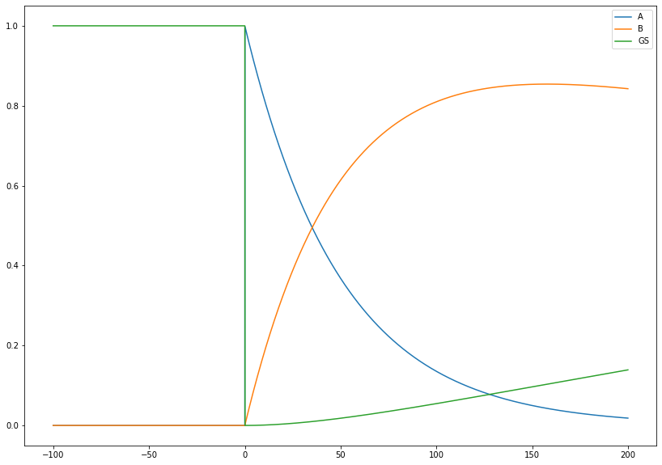
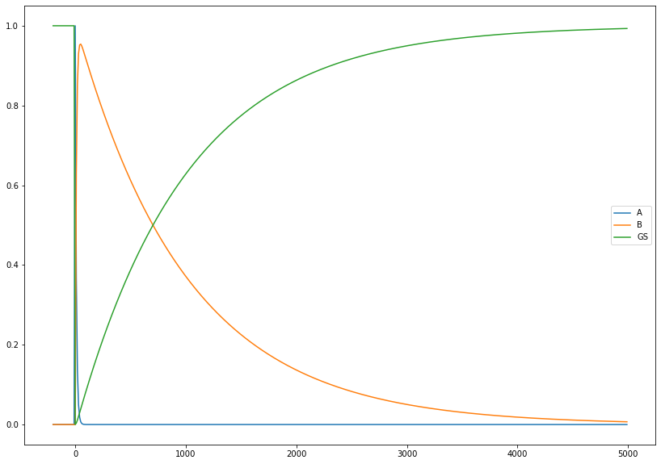
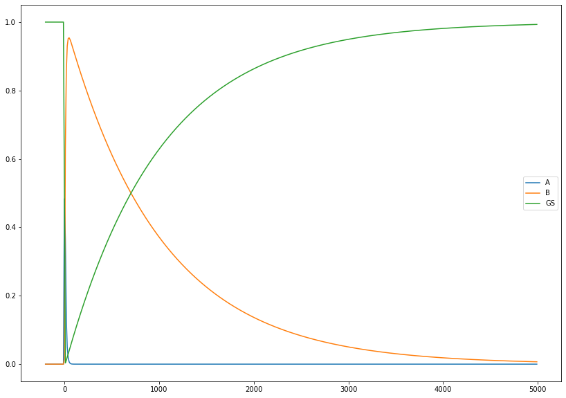
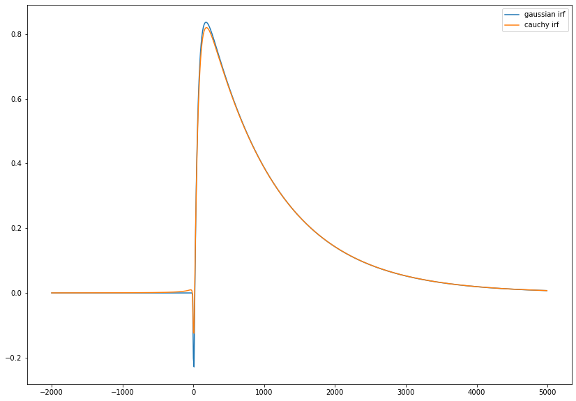
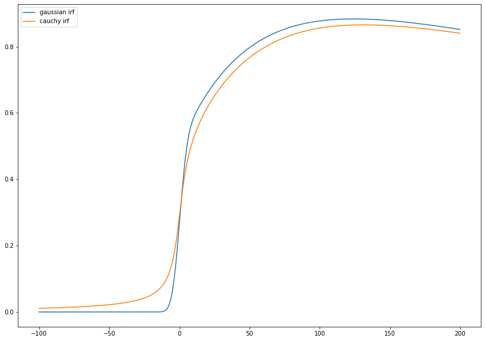
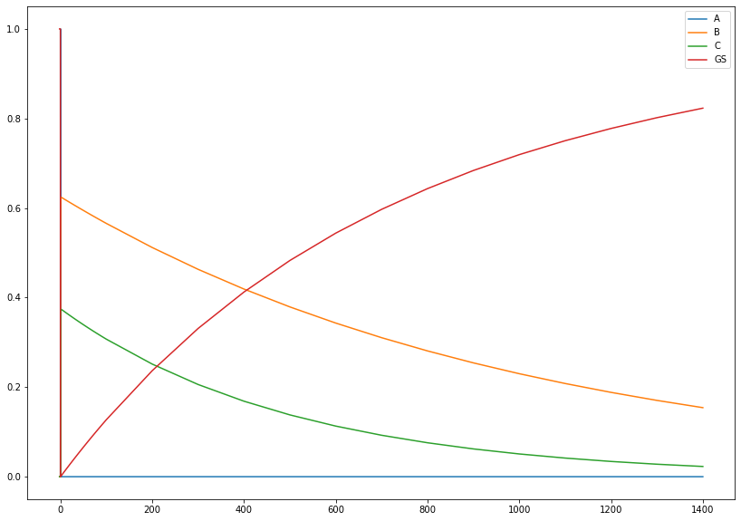
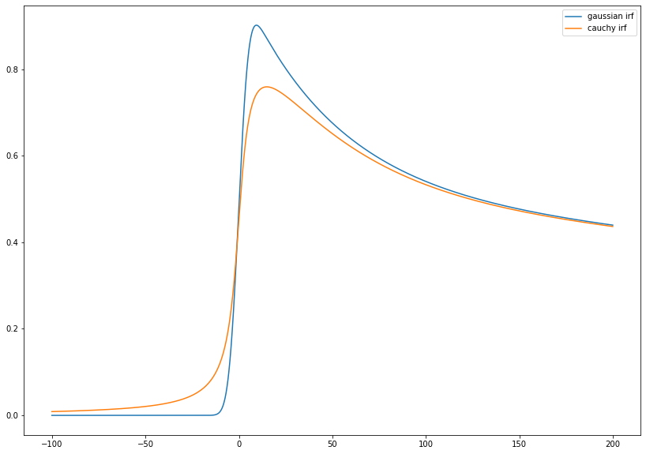

# Rate Equation
## Objective
1. Define equation
2. Solve equation
3. Compute model and signal

```{note}
In this example, we only deal with gaussian and cauchy irf with same fwhm
```


```python
# import needed module
import numpy as np
import matplotlib.pyplot as plt
import TRXASprefitpack
from TRXASprefitpack import solve_model, compute_model, rate_eq_conv 
plt.rcParams["figure.figsize"] = (14,10)
```

## Version information


```python
print(TRXASprefitpack.__version__)
```

    0.5.0


## basic information of functions


```python
help(solve_model)
```

    Help on function solve_model in module TRXASprefitpack.mathfun.rate_eq:
    
    solve_model(equation: numpy.ndarray, y0: numpy.ndarray) -> Tuple[numpy.ndarray, numpy.ndarray, numpy.ndarray]
        Solve system of first order rate equation
        
        Args:
          equation: matrix corresponding to model
          y0: initial condition
        
        Returns:
           1. eigenvalues of equation
           2. eigenvectors for equation
           3. coefficient where y0 = Vc
    


```python
help(compute_model)
```

    Help on function compute_model in module TRXASprefitpack.mathfun.rate_eq:
    
    compute_model(t: numpy.ndarray, eigval: numpy.ndarray, V: numpy.ndarray, c: numpy.ndarray) -> numpy.ndarray
        Compute solution of the system of rate equations solved by solve_model
        Note: eigval, V, c should be obtained from solve_model
        
        Args:
         t: time
         eigval: eigenvalue for equation
         V: eigenvectors for equation
         c: coefficient
        
        Returns:
          solution of rate equation
        
        Note:
          eigval, V, c should be obtained from solve_model.
    


```python
help(rate_eq_conv)
```

    Help on function rate_eq_conv in module TRXASprefitpack.mathfun.exp_decay_fit:
    
    rate_eq_conv(t: numpy.ndarray, fwhm: Union[float, numpy.ndarray], abs: numpy.ndarray, eigval: numpy.ndarray, V: numpy.ndarray, c: numpy.ndarray, irf: Union[str, NoneType] = 'g', eta: Union[float, NoneType] = None) -> numpy.ndarray
        Constructs signal model rate equation with
        instrumental response function
        Supported instrumental response function are
        
        irf
          * g: gaussian distribution
          * c: cauchy distribution
          * pv: pseudo voigt profile
        
        Args:
           t: time
           fwhm: full width at half maximum of instrumental response function
           abs: coefficient for each excited state
           eigval: eigenvalue of rate equation matrix 
           V: eigenvector of rate equation matrix 
           c: coefficient to match initial condition of rate equation
           irf: shape of instrumental
                response function [default: g]
        
                  * 'g': normalized gaussian distribution,
                  * 'c': normalized cauchy distribution,
                  * 'pv': pseudo voigt profile :math:`(1-\eta)g + \eta c`
           eta: mixing parameter for pseudo voigt profile
                (only needed for pseudo voigt profile,
                default value is guessed according to
                Journal of Applied Crystallography. 33 (6): 1311–1316.)
        
        Returns:
          Convolution of the solution of the rate equation and instrumental
          response function.
        
        Note:
            *fwhm* For gaussian and cauchy distribution,
            only one value of fwhm is needed,
            so fwhm is assumed to be float
            However, for pseudo voigt profile,
            it needs two value of fwhm, one for gaussian part and
            the other for cauchy part.
            So, in this case,
            fwhm is assumed to be numpy.ndarray with size 2.
    


## Define equation

```{note}
In pump-probe time resolved spectroscopy, 
the concentration of ground state is not much important.
Only, the concentration of excited species are matter.
```

Consider model
```{code-block} python
'''
    k1     k2
A  ---> B ---> GS
y1: A
y2: B
y3: GS
'''
```

with initial condition 
\begin{equation*}
y(t) = \begin{cases}
(0, 0, 1) & \text{if $t < 0$}, \\
(1, 0, 0) & \text{if $t=0$}.
\end{cases}
\end{equation*}

Then what we need to solve is

\begin{equation*}
y'(t) = \begin{cases}
(0, 0, 0) & \text{if $t < 0$}, \\
Ay(t) & \text{if $t \geq 0$}
\end{cases}
\end{equation*}

with $y(0)=y_0$.

Where $A$ is

\begin{equation*}
A = \begin{pmatrix}
-k_1 & 0 & 0 \\
k_1 & -k_2 & 0 \\
0 & k_2 & 0
\end{pmatrix}
\end{equation*}


```python
# set lifetime tau1 = 50 ps, tau2 = 1 ns
# set fwhm of IRF = 10 ps

tau1 = 50
tau2 = 1000
fwhm = 10

# initial condition
y0 = np.array([1, 0, 0])

# set time range
t_short = np.arange(-100,200,0.1)
t_long = np.arange(-2000,5000,10)

# Define equation
equation = np.array([[-1/tau1, 0, 0],
                    [1/tau1, -1/tau2, 0],
                    [0, 1/tau2, 0]])

# Solve equation
eigval, V, c = solve_model(equation, y0)
```


```python
# Now compute model
y_short = compute_model(t_short, eigval, V, c)
y_long = compute_model(t_long, eigval, V, c)


# since, y_1 + y_2 + y_3 = 1 for all t,
# y3 = 1 - (y_1+y_2)

y_short[-1, :] = 1 - (y_short[0, :] + y_short[1, :])
y_long[-1, :] = 1 - (y_long[0, :] + y_long[1, :])
```

## plot model
1. short range


```python
plt.plot(t_short, y_short[0, :], label='A')
plt.plot(t_short, y_short[1, :], label='B')
plt.plot(t_short, y_short[2, :], label='GS')
plt.legend()
plt.show()
```


    

    


2. long range


```python
plt.plot(t_long, y_long[0, :], label='A')
plt.plot(t_long, y_long[1, :], label='B')
plt.plot(t_long, y_long[2, :], label='GS')
plt.legend()
plt.show()
```


    

    


## Compute Signal 
Difference absorption coefficient of ground state is 0
Now assume the difference absorption coefficient of A state is -0.5 and B state is 1


```python
diff_abs = [-0.5, # A state
            1, # B state
            0, # ground state
           ]
y_short_gau = rate_eq_conv(t_short, fwhm, diff_abs, eigval, V, c, irf = 'g')
y_long_gau = rate_eq_conv(t_long, fwhm, diff_abs, eigval, V, c, irf = 'g')
y_short_cauchy = rate_eq_conv(t_short, fwhm, diff_abs, eigval, V, c, irf = 'c')
y_long_cauchy = rate_eq_conv(t_long, fwhm, diff_abs, eigval, V, c, irf = 'c')
```

## Plot signal
1. short range


```python
plt.plot(t_short, y_short_gau, label='gaussian irf')
plt.plot(t_short, y_short_cauchy, label='cauchy irf')
plt.legend()
plt.show()
```


    

    


2. long range


```python
plt.plot(t_long, y_long_gau, label='gaussian irf')
plt.plot(t_long, y_long_cauchy, label='cauchy irf')
plt.legend()
plt.show()
```


    

    


## Compute Signal -2-
Difference absorption coefficient of ground state is 0
Now assume the difference absorption coefficient of A state is 0.5 and B state is 1


```python
diff_abs = [0.5, # A state
            1, # B state
            0, # ground state
           ]
y_short_gau = rate_eq_conv(t_short, fwhm, diff_abs, eigval, V, c, irf = 'g')
y_long_gau = rate_eq_conv(t_long, fwhm, diff_abs, eigval, V, c, irf = 'g')
y_short_cauchy = rate_eq_conv(t_short, fwhm, diff_abs, eigval, V, c, irf = 'c')
y_long_cauchy = rate_eq_conv(t_long, fwhm, diff_abs, eigval, V, c, irf = 'c')
```

## Plot signal -2-
1. short range


```python
plt.plot(t_short, y_short_gau, label='gaussian irf')
plt.plot(t_short, y_short_cauchy, label='cauchy irf')
plt.legend()
plt.show()
```


    

    


2. long range


```python
plt.plot(t_long, y_long_gau, label='gaussian irf')
plt.plot(t_long, y_long_cauchy, label='cauchy irf')
plt.legend()
plt.show()
```


    

    


## Compute Signal -3-
Difference absorption coefficient of ground state is 0
Now assume the difference absorption coefficient of A state is 1 and B state is 0.5


```python
diff_abs = [1, # A state
            0.5, # B state
            0, # ground state
           ]
y_short_gau = rate_eq_conv(t_short, fwhm, diff_abs, eigval, V, c, irf = 'g')
y_long_gau = rate_eq_conv(t_long, fwhm, diff_abs, eigval, V, c, irf = 'g')
y_short_cauchy = rate_eq_conv(t_short, fwhm, diff_abs, eigval, V, c, irf = 'c')
y_long_cauchy = rate_eq_conv(t_long, fwhm, diff_abs, eigval, V, c, irf = 'c')
```

## Plot signal -3-
1. short range


```python
plt.plot(t_short, y_short_gau, label='gaussian irf')
plt.plot(t_short, y_short_cauchy, label='cauchy irf')
plt.legend()
plt.show()
```


    

    


2. long range


```python
plt.plot(t_long, y_long_gau, label='gaussian irf')
plt.plot(t_long, y_long_cauchy, label='cauchy irf')
plt.legend()
plt.show()
```


    

    


## Conclusion
1. IRF broads the signal
2. At short range, gaussian signal is much sharper than cauchy signal.
3. At long range, gaussian signal and cauchy signal look similar.
4. If sign of difference abs of short lifetime state (A) and long lifetime state (B) is different, we can easy to see short lived state feature in the time trace spectrum.
5. If sign of two state is same and intensity of long lifetime state (B) is larger than that of short lifetime state (A), we hard to observe short lived state feature.
6. If sign of two state is same but intensity of short lifetime state (A) is larger than that of long lifetime state (B), we can see short lived state feature.
